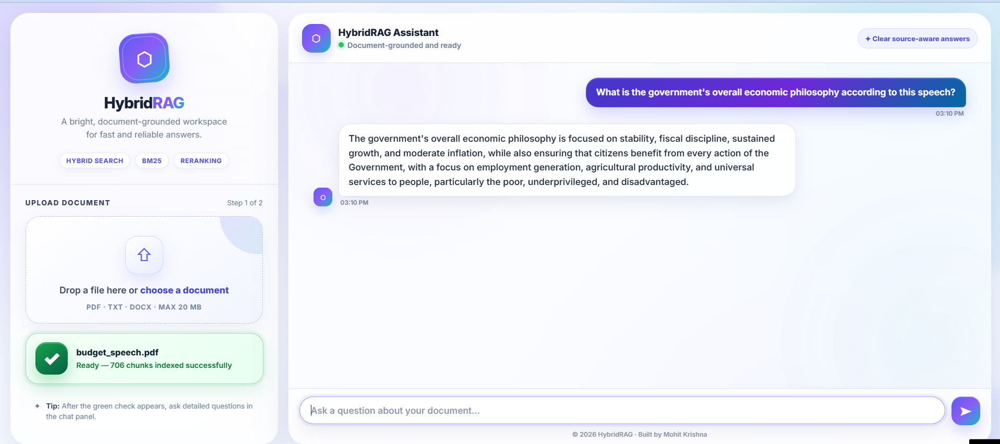

# HybridRAG — Production-Grade RAG Chatbot

Upload any document and get precise, grounded answers powered by a full hybrid retrieval pipeline — not just basic semantic search.

## Demo


## Why HybridRAG is Different

Most RAG demos use a single embedding model for retrieval. HybridRAG combines four retrieval techniques in sequence:

1. **Semantic search** — finds conceptually similar chunks via embeddings
2. **BM25 keyword search** — catches exact matches that semantic search misses (codes, names, specific terms)
3. **RRF fusion** — merges both ranked lists into one without score-scale conflicts
4. **Cross-encoder reranking** — re-scores the fused candidates with query+chunk interaction for final precision

## Tech Stack

| Layer | Tool |
|---|---|
| Document parsing | PyMuPDF, python-docx |
| Chunking | Semantic chunking (embedding-based topic boundaries) |
| Embeddings | `sentence-transformers/all-MiniLM-L6-v2` |
| Keyword search | BM25Okapi (`rank-bm25`) |
| Vector storage | LanceDB (persistent, unlike FAISS) |
| Reranking | `cross-encoder/ms-marco-MiniLM-L-6-v2` |
| LLM | Groq API (`llama-3.3-70b-versatile`) |
| Evaluation | Sentence-level semantic faithfulness scoring |
| Guardrails | Regex-based input/output safety checks |
| Logging | Per-response latency, faithfulness score, guardrail triggers |

## Two Architectures

**Gradio Standalone (Docker-ready):**
```bash
python app.py
```
Visit `http://localhost:7860`

**FastAPI + Custom UI:**
```bash
uvicorn fastapi_backend:app --reload
```
Visit `http://localhost:8000`

## Run Locally

```bash
git clone https://github.com/mohitkrishna21/HybridRAG.git
cd HybridRAG
pip install -r requirements.txt
```

Add your `GROQ_API_KEY` to a `.env` file:

## Run with Docker

```bash
docker build -t hybridrag .
docker run -p 7860:7860 --env-file .env -v huggingface_cache:/root/.cache/huggingface hybridrag
```

Visit `http://localhost:7860`

## Supported Formats
PDF · TXT · DOCX · Max 20MB

## Run Tests

```bash
pytest tests/ -v
```

## License
MIT
